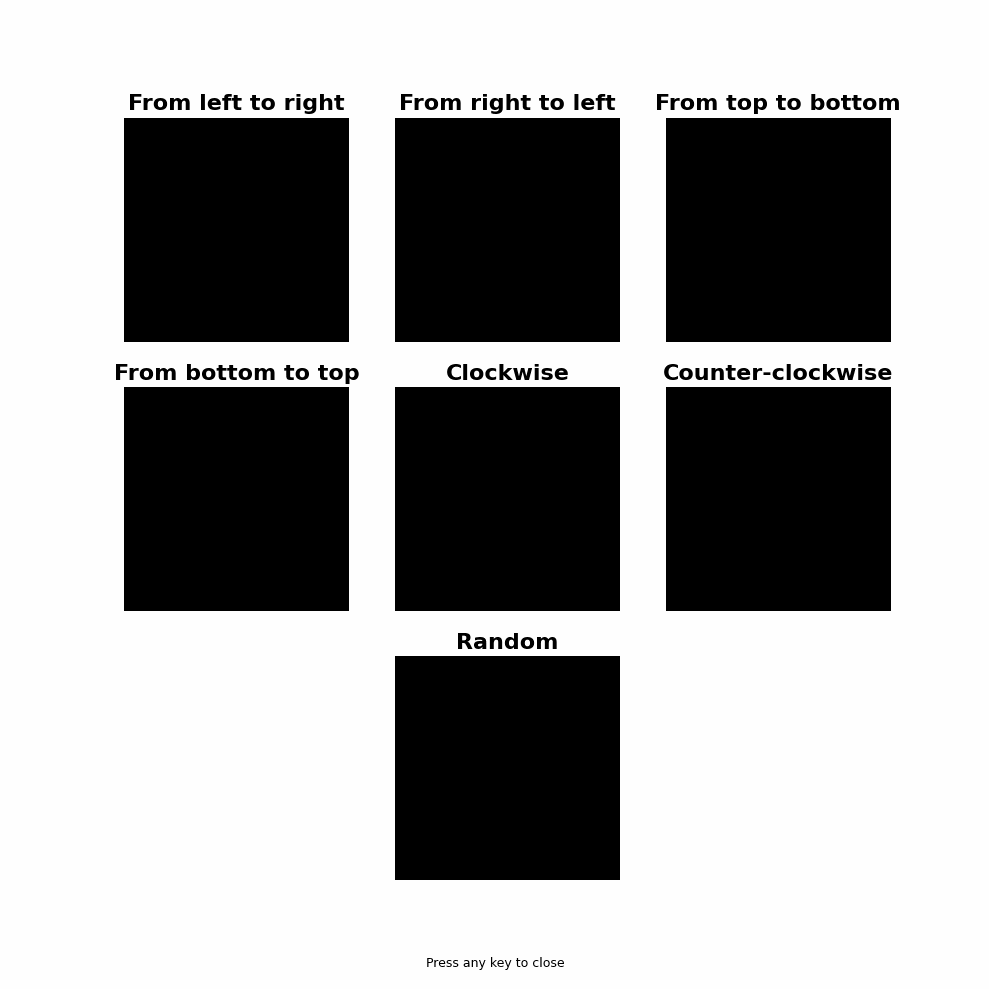

# Liquid State Machine per la classificazione di traiettorie (32×32)

Questo repository mostra un esempio d’uso della classe `SNN` di **snnpy**  
(`from snnpy.snn import SNN, SimulationParams, STDPParams`, installabile con `pip install snnpy`).

L’esperimento implementa una **Liquid State Machine (LSM)** che classifica la **traiettoria di una pallina in un video** tra diverse classi possibili, nonostante **rumore** e **jitter**.

<p align="center">
  
</p>


✅ Cosa prova l’esperimento

Con un’accuratezza media su 10 fold superiore a 0.9, si conferma che una Liquid State Machine è in grado di lavorare con dati sparsi, temporali e molto rumorosi.
Gli errori residui nella confusion matrix tendono a riguardare la direzione (es. left_right vs right_left) più che la tipologia (lineare vs circolare). L’accuratezza può aumentare generando più esempi per classe.
---

## 🧠 Idea

- Generiamo un dataset di **video 32×32×100** (H×W×T) in cui una pallina si muove lungo traiettorie diverse.
- Ogni video è passato al **reservoir** della LSM **frame-per-frame** (il simulatore riceve un frame alla volta), e da alcuni neuroni di output si estraggono **feature temporali**.
- Un **readout** (Random Forest) impara a classificare l’orbita.

---

## 📦 Classi di traiettoria

- `left_right` – da sinistra a destra  
- `right_left` – da destra a sinistra  
- `top_bottom` – dall’alto in basso  
- `bottom_top` – dal basso in alto  
- `clockwise` – circolare, senso orario  
- `counter_clockwise` – circolare, senso antiorario  
- `random` – posizioni casuali

Ogni video ha:
- **griglia** 32×32,
- **100 frame**,
- pallina con **forma e dimensione casuali** (cerchio/ellisse),
- **jitter** sulla posizione e **rumore di frame**,
- **punto di partenza** casuale.

---

## 🔧 Requisiti e installazione

1. Clona il repo e crea l’ambiente (consigliato):
   ```bash
   python -m venv env
   # Linux/Mac
   source env/bin/activate
   # Windows
   .\env\Scripts\activate
